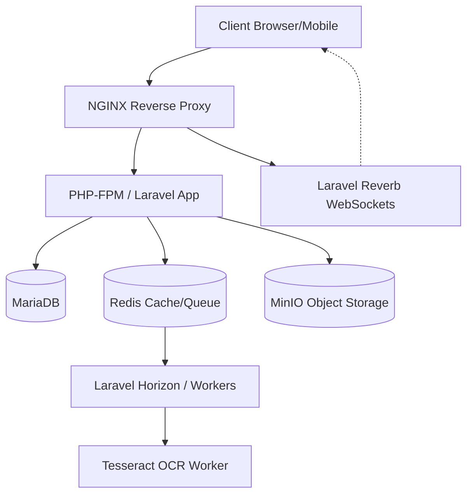

# Garage Guardian System

Enterprise fleet/garage management system built with Laravel 11, React 18, MariaDB, Redis, and MinIO.

## Tech Stack
| Component | Technology |
|---|---|
| Backend | Laravel 11, PHP 8.3 |
| Frontend | React 18, TailwindCSS |
| Database | MariaDB 11.2 |
| Cache & Queue | Redis 7 |
| Storage | MinIO (S3 Compatible) |
| WebSockets | Laravel Reverb |
| OCR | Tesseract (Self-hosted) |

## Quick Start (Development)
1. Prerequisites: Docker Desktop, Git
2. Clone + setup:
   ```bash
   git clone <repository_url>
   cp .env.example .env
   make setup
   ```
3. Access: 
   - App: http://localhost
   - Horizon: http://localhost/horizon 
   - Mailpit: http://localhost:8025

## Default Credentials
- Admin: admin@techaura-projects.com / Change@Me1234!

## Architecture Overview


## Key Features
- Vehicle & fleet management
- Job card lifecycle (Open → In Progress → Pending Parts → QC Review → Completed)
- Parts request & approval workflow
- Multi-level purchase order approvals (Manager + Finance)
- Real-time bay monitoring (WebSocket via Reverb)
- OCR plate scanning (Tesseract self-hosted)
- QC inspection with digital signatures
- Role-based access: Admin, Supervisor, Mechanic, Store Clerk, QC Inspector
- Bilingual: English + Arabic (RTL)
- Prometheus metrics + Grafana dashboards

## Development Commands
| Command | Description |
|---|---|
| `make up` | Start all containers |
| `make down` | Stop all containers |
| `make setup` | Initial setup (install deps, migrate, seed) |
| `make migrate` | Run database migrations |
| `make test` | Run PHPUnit tests |
| `make shell` | Open bash shell in php container |

## Deployment
See docs/DEPLOYMENT.md

## API Documentation
See docs/API.md or access /api/documentation in development

## License
Proprietary
