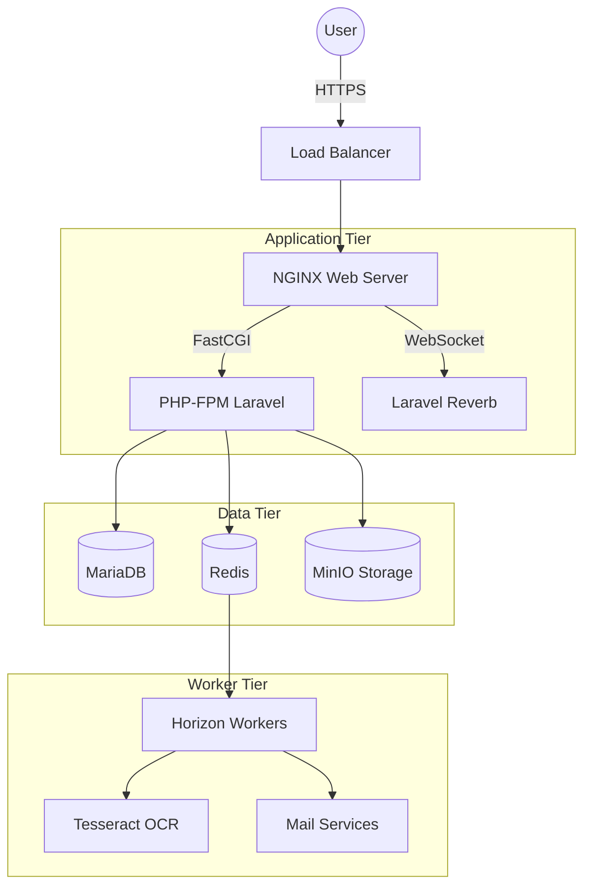

# Architecture Document

## System Overview
The Garage Guardian System is a modern, decoupled web application.

## Components
- **NGINX**: Acts as reverse proxy, handles SSL termination and static file serving.
- **PHP-FPM**: Executes Laravel PHP application logic.
- **Reverb**: Native Laravel WebSocket server for real-time updates.
- **Horizon**: Dashboard and process manager for Laravel Redis queues.
- **MariaDB**: Relational database for persistent data storage.
- **Redis**: In-memory data structure store for caching and queues.
- **MinIO**: S3-compatible object storage for file uploads (signatures, attachments).
- **Tesseract**: OCR engine for automated license plate recognition.
- **Prometheus/Grafana**: System metrics monitoring and visualization.

## Authentication Flow
- Web SPA: Uses Laravel Sanctum with cookie-based session authentication.
- Mobile/External APIs: Uses Laravel Sanctum API tokens.

## WebSocket Flow
1. Client connects to NGINX via WSS.
2. NGINX proxies connection to Laravel Reverb.
3. Laravel broadcasts events via Reverb to connected clients.

## OCR Scan Flow
1. Mobile camera captures image.
2. Companion app uploads image via API.
3. API dispatches job to queue.
4. Horizon worker processes image via Tesseract.
5. Extracted text is broadcasted back to client via WebSocket.

## Approval Workflows
- **Parts Request**: Mechanic -> Supervisor (Approve/Reject) -> Store Clerk (Issue).
- **Purchase Order**: Creator -> Manager (Approve/Reject) -> Finance (Approve/Reject).
