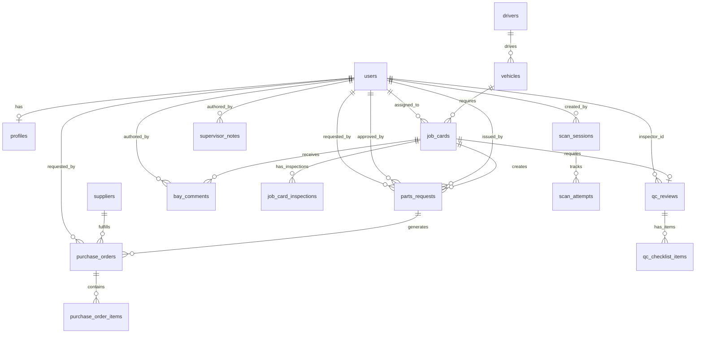

# Database Documentation

## ER Diagram

## Table Descriptions
- `users`: Standard Laravel authentication table.
- `profiles`: Extended user details including settings and preferences.
- `drivers`: Manages driver details and licensing.
- `vehicles`: Tracks fleet vehicles, their status, and assignments.
- `suppliers`: Vendors for parts and services.
- `job_cards`: Core entity tracking maintenance and repair jobs.
- `job_card_inspections`: Checklist items associated with a specific job card.
- `parts_requests`: Requests for inventory parts linked to jobs.
- `purchase_orders`: Orders placed with suppliers for parts.
- `purchase_order_items`: Line items for purchase orders.
- `inventory_items`: Catalog of parts tracked in stock.
- `qc_reviews`: Quality Control reviews for completed job cards.
- `qc_checklist_items`: Individual checklist items within a QC review.
- `scan_sessions`: Active scanning sessions for license plates.
- `scan_attempts`: Individual OCR attempts within a scan session.
- `bay_comments`: General comments assigned to a work bay or job card.
- `supervisor_notes`: Administrative notes from supervisors.
- `audit_logs`: System-wide audit trail for critical actions.
- `app_settings`: Key-value store for global application settings.
- `preview_cache_stats`: Performance metrics for cached data.

## Key Business Rules
1. **Soft Deletes**: Enabled on all major entities to preserve history.
2. **UUIDs**: Used as primary keys across all tables for distributed uniqueness.
3. **SLA Tracking**: `job_cards` track SLA hours to measure completion timeliness.
4. **Signatures**: Normalized signature data exists on `job_cards`, `parts_requests`, and `qc_reviews`.
5. **MariaDB Compatibility**: Designed specifically for MariaDB 10.11 standards.
